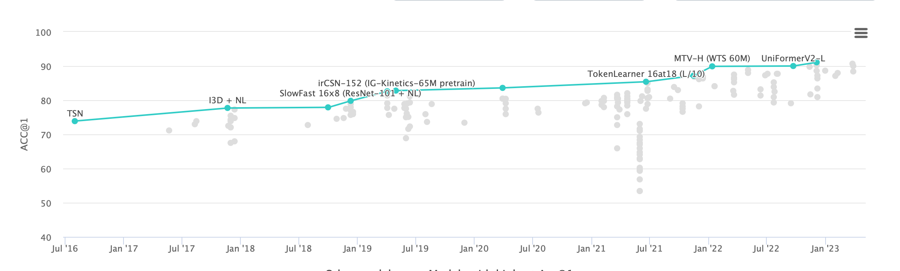

# 视频理解和行为识别

[paper](https://paperswithcode.com/sota/action-classification-on-kinetics-400)

## 数据集介绍

| 数据集名称                                     | 简介                                                         | 链接                                                         |
| ---------------------------------------------- | ------------------------------------------------------------ | ------------------------------------------------------------ |
| **UCF101 (University of Central Florida 101)** | 由YouTube视频构成的行为识别数据集，包含101个类别和约13000段视频。视频都是人为标记的，涵盖了各种日常活动。 | [UCF101](https://www.crcv.ucf.edu/data/UCF101.php)           |
| **Something-Something**                        | 这个数据集注重物体与物体之间的交互，以及人与物体的交互。它包含了两个版本，v1包含了108个类别和约110000个视频剪辑，v2包含了174个类别和约220000个视频剪辑。 | [Something-Something](https://20bn.com/datasets/something-something) |
| **Charades**                                   | 这个数据集专注于复杂的日常活动，包含了约10000段由Amazon Mechanical Turk工人在家中拍摄的视频，以及157个活动类别。 | [Charades](http://allenai.org/plato/charades/)               |
| **AVA (Atomic Visual Actions)**                | AVA数据集专注于人与人之间的交互，包含80个动作类别，其特点是会为视频中每秒钟的动作标记出精确的边界框。 | [AVA](https://research.google.com/ava/)                      |
| **Moments in Time**                            | 这个数据集包含了大约一百万段3秒钟的视频剪辑，覆盖了大约339种不同的动作和活动。 | [Moments in Time](http://moments.csail.mit.edu/)             |
| **Sports-1M**                                  | 这个数据集包含了约100万段YouTube视频，覆盖了大约500种不同的体育活动。 | [Sports-1M](https://cs.stanford.edu/people/karpathy/deepvideo/) |
| **Jester**                                     | 这是一个专门针对手势识别的数据集，包含27种手势和约150000段视频。 | [Jester](https://20bn.com/datasets/jester)                   |
| **HMDB51 (Human Motion DataBase)**             | 这个数据集包含了7000多个分割后的视频片段，覆盖51个动作类别。每个类别至少包含101个视频剪辑。 | [HMDB51](http://serre-lab.clps.brown.edu/resource/hmdb-a-large-human-motion-database/) |
| **Kinetics-400 (K400)**                        | 这是一个大规模的视频行为识别数据集，包含约40万个YouTube视频片段，涵盖400个人类行为类别。 | [Kinetics-400](https://deepmind.com/research/open-source/kinetics) |

## 相关算法

| Action Recognition | Link                                         | paper                                                        |
| ------------------ | -------------------------------------------- | ------------------------------------------------------------ |
| SlowFast           | https://github.com/facebookresearch/SlowFast | [ICCV 2019](https://alexander-kirillov.github.io/tutorials/visual-recognition-iccv19/) |
|                    |                                              |                                                              |
|                    |                                              |                                                              |

## 相关框架

- towhee https://github.com/towhee-io/examples/blob/main/video/video_tagging/action_classification.ipynb https://towhee.io/tasks/operator
- mmpose open detection https://github.com/open-mmlab/playground/blob/main/mmpose_open_detection/README_zh-CN.md
- MMAction2 https://github.com/open-mmlab/mmaction2/blob/main/README.md