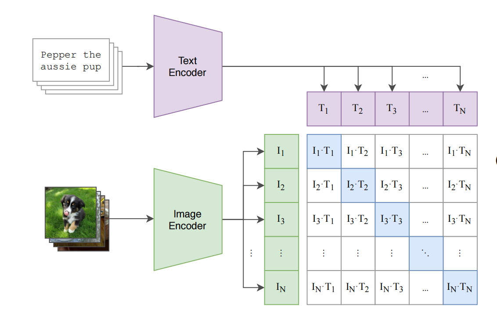
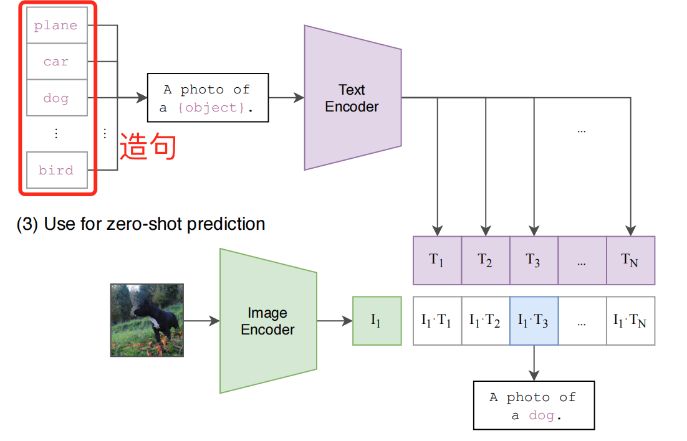
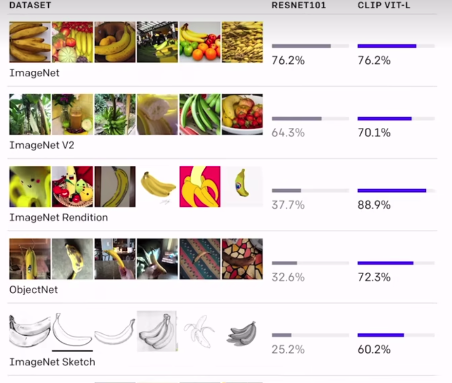
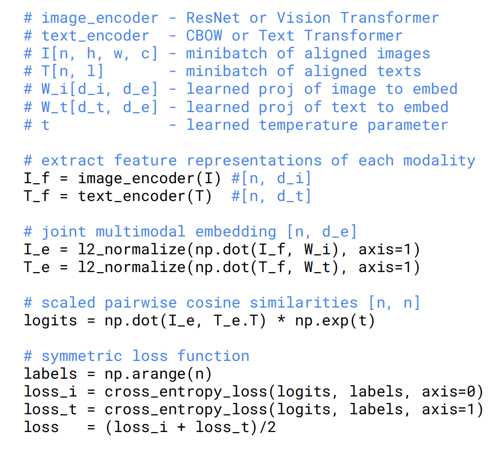
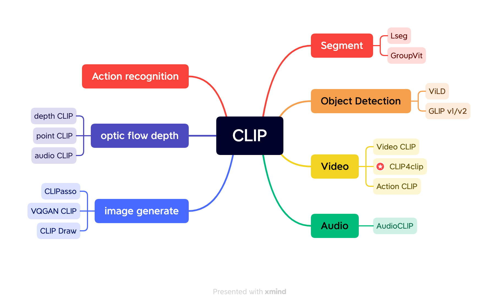

# CLIP论文精读（**Learning Transferable Visual Models From Natural Language Supervision**）

> 论文地址: https://arxiv.org/abs/2103.00020 （26 Feb 2021）

## 摘要:

​		本论文提出了一种新颖的方法，利用自然语言监督来学习可转移的视觉模型。该方法基于现有的预训练语言模型（如GPT-4），通过结合视觉和文本信息，实现对图像数据的更丰富的理解。这种新颖的方法强调了通过自然语言监督来捕捉视觉知识的潜力，从而在各种计算机视觉任务中取得更好的泛化性能。

该方法的核心思想是使用大量未标注的图像-文本对来训练一个视觉-语言联合模型。在这个过程中，模型需要学会理解图像内容与相关文本描述之间的关系。这种理解被认为是可转移的，因为模型可以将从一种任务中学到的知识应用到其他任务上，以提高其性能。

实验结果表明，通过自然语言监督学习的视觉模型在多个计算机视觉任务上表现出色，如图像分类、物体检测和语义分割。与传统的监督学习方法相比，本方法在许多任务上实现了显著的性能提升，证明了自然语言监督对于学习可转移视觉知识的有效性。

总之，本论文提出了一种基于自然语言监督的方法，用于学习具有广泛泛化能力的视觉模型。实验结果验证了该方法在多种计算机视觉任务上的有效性，为未来研究提供了一个有趣的方向。

该方法可应用于多种任务，包括：OCR、动作检测、目标跟踪。	

## 模型总览：

###  训练步骤

> openai 准备了4亿个图片和文本对

* 通过自然语言处理生成的监督信号可以训练一个迁移效果很好的视觉模型 

 

- 在模型的训练过程输入是一个图片和一个文字的配对
- 通过图像的编码器和文字编码器生成Image Encoder和Text Encoder，图像编码器可以使用ResNet和Vision Transformer
- 每个training batch都有N个图像文本对
- CLIP在特征上做对比学习（通过正样本和负样本做对比训练），在特征矩阵里，沿着对角线方向上的为正样本，其余不是对角线的样本都是负样本，负样本的个数n^2-n

## zero-shot推理

> 由于CLIP没有在分类的任务上进行继续学习和微调，所以CLIP没有分类头，作者采用了一种自然语言处理的方式promt template

### promt template

 

- 将ImageNet所有类别进行造句，由于训练过程使用的不是单个单词所有需要造句。
- 将图片送入编码器得到图片的特征，将所有图片特征和文本特征通过cosine similarity计算相识性。
- 将相似性最高的句子挑出来，得到所需的分类

### 测试效果

## 基于CLIP的应用

- clifs https://github.com/johanmodin/clifs  根据给定的信息在视频中做目标检索

## 伪代码

## CLIP下游任务

| 任务类型              | Link                                               | arXiv                            |
| --------------------- | -------------------------------------------------- | -------------------------------- |
| Action Classification | https://github.com/sallymmx/ActionCLIP/tree/master | https://arxiv.org/abs/2109.08472 |
|                       |                                                    |                                  |
|                       |                                                    |                                  |

